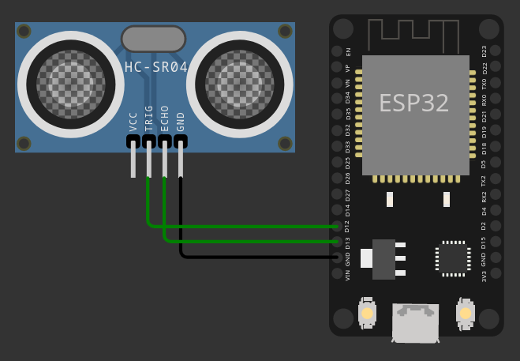

<h1>Parking Occupancy Node with Wokwi</h1>

[![License: MIT][license-image]][license]

This project is an optional activity of "Internet of Things", course of "**Computer Science and Engineering**" (MSc) held at Politecnico di Milano (2023/2024).

**Professor**: Matteo Cesana

**Final Score**: 4 / 4

<h2>Project specification</h2>

The project consists of the design and implementation of a simple parking occupancy node using Wokwi, a web-based platform that allows you to simulate and test various IoT and embedded system projects using ESP32, STM32, Arduino, Raspberry Pi Pico and other devices.

The node is designed to detect the presence of a car in a parking spot and send the information to a central ESP32 sink node (star topology), minimizing the power consumption and the energy used. 

To achieve this, the node is equipped with a HC-SR04 ultrasonic distance sensor and the ESP-NOW protocol is used to send the information to the sink node.

In order to minimize the power consumption, the node is designed to be in deep sleep mode most
of the time, waking up periodically, with a defined duty cycle, to check the presence of a car.

You can find all the details about the project in the [report](report/report.pdf), the code of the project in the [src](src) folder and the simulation on Wokwi at [https://wokwi.com/projects/391892882305438721](https://wokwi.com/projects/391892882305438721).

<h2>Copyright and license</h2>

This project is copyright 2022.

Licensed under the **[MIT License][license]**; you may not use this software except in compliance with the License.

[license]: https://github.com/christian-confalonieri/Parking-Occupancy-Node-with-Wokwi/blob/main/LICENSE
[license-image]: https://img.shields.io/badge/License-MIT-blue.svg